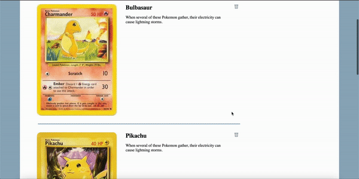

# pokemon-Cards

Pokemon cards renders the list of pokemons on page load from the API, which include names, descriptions and an image. It also gives you the feature to delete, and add pokemon cards to the list. Mobile friendly.

## Installation (for standard modern project) and run project

```bash
yarn add o npm i
```

```bash
yarn next build
```

```bash
yarn run dev
```

## How to use?

1. On page load the app renders the lists of pokemon cards from the API,
2. Delete a pokemon card by clicking on the delete button,
3. Add your own pokemon cards to the list by visiting the add pokemon page and filling the requirements.

## Demo



#### Live link

```
http://pokemon-cards-kappa.vercel.app/
```

## Stack

 
